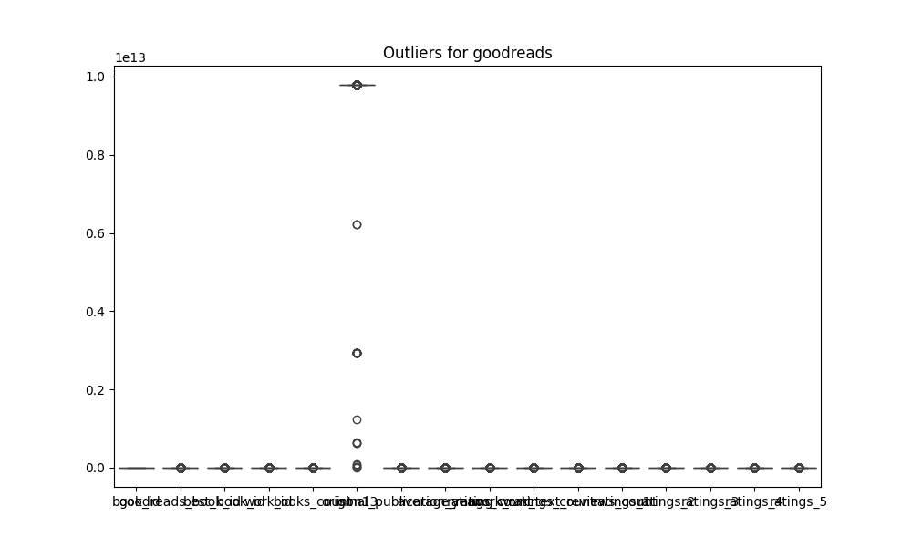

# Automated Data Analysis
## Analysis of goodreads.csv
### Summary Statistics
           book_id  goodreads_book_id  best_book_id       work_id   books_count        isbn13  original_publication_year  average_rating  ratings_count  work_ratings_count  work_text_reviews_count      ratings_1      ratings_2      ratings_3     ratings_4     ratings_5
count  10000.00000       1.000000e+04  1.000000e+04  1.000000e+04  10000.000000  9.415000e+03                9979.000000    10000.000000   1.000000e+04        1.000000e+04             10000.000000   10000.000000   10000.000000   10000.000000  1.000000e+04  1.000000e+04
mean    5000.50000       5.264697e+06  5.471214e+06  8.646183e+06     75.712700  9.755044e+12                1981.987674        4.002191   5.400124e+04        5.968732e+04              2919.955300    1345.040600    3110.885000   11475.893800  1.996570e+04  2.378981e+04
std     2886.89568       7.575462e+06  7.827330e+06  1.175106e+07    170.470728  4.428619e+11                 152.576665        0.254427   1.573700e+05        1.678038e+05              6124.378132    6635.626263    9717.123578   28546.449183  5.144736e+04  7.976889e+04
min        1.00000       1.000000e+00  1.000000e+00  8.700000e+01      1.000000  1.951703e+08               -1750.000000        2.470000   2.716000e+03        5.510000e+03                 3.000000      11.000000      30.000000     323.000000  7.500000e+02  7.540000e+02
25%     2500.75000       4.627575e+04  4.791175e+04  1.008841e+06     23.000000  9.780316e+12                1990.000000        3.850000   1.356875e+04        1.543875e+04               694.000000     196.000000     656.000000    3112.000000  5.405750e+03  5.334000e+03
50%     5000.50000       3.949655e+05  4.251235e+05  2.719524e+06     40.000000  9.780452e+12                2004.000000        4.020000   2.115550e+04        2.383250e+04              1402.000000     391.000000    1163.000000    4894.000000  8.269500e+03  8.836000e+03
75%     7500.25000       9.382225e+06  9.636112e+06  1.451775e+07     67.000000  9.780831e+12                2011.000000        4.180000   4.105350e+04        4.591500e+04              2744.250000     885.000000    2353.250000    9287.000000  1.602350e+04  1.730450e+04
max    10000.00000       3.328864e+07  3.553423e+07  5.639960e+07   3455.000000  9.790008e+12                2017.000000        4.820000   4.780653e+06        4.942365e+06            155254.000000  456191.000000  436802.000000  793319.000000  1.481305e+06  3.011543e+06
### Missing Values
book_id                         0
goodreads_book_id               0
best_book_id                    0
work_id                         0
books_count                     0
isbn                          700
isbn13                        585
authors                         0
original_publication_year      21
original_title                585
title                           0
language_code                1084
average_rating                  0
ratings_count                   0
work_ratings_count              0
work_text_reviews_count         0
ratings_1                       0
ratings_2                       0
ratings_3                       0
ratings_4                       0
ratings_5                       0
image_url                       0
small_image_url                 0
### Correlation Matrix

### Outliers

### Trend Analysis

### Analysis Story
### Comprehensive Narrative on Data Analysis of Book Ratings

#### **Data Overview**

The dataset consists of 10,000 entries pertaining to books, with various attributes related to their ratings, publication details, and author information. It includes identifiers such as `book_id`, `goodreads_book_id`, and `work_id`, quantitative ratings (`average_rating`, `ratings_count`, `work_ratings_count`), and categorical features like `original_publication_year`, `title`, and several ratings divided into categories (from 1 to 5).

#### **Missing Values Analysis**

There are several fields with missing values in the dataset:

- `isbn`: 700 missing entries
- `isbn13`: 585 missing entries
- `original_publication_year`: 21 missing entries
- `original_title`: 585 missing entries
- `language_code`: 1084 missing entries

The most significant concerns are the missing `isbn` and `language_code` values, which could affect any analysis related to book identifiers and categorization by language.

#### **Summary Statistics**

- **Publication Year**: The publication years range from 1750 to 2017, with a mean year of approximately 1982, indicating a dataset skewed toward mid-20th-century publications.
- **Average Rating**: The average book rating is approximately 4.00, showing generally favorable reception among readers.
- **Ratings Count**: The average number of ratings a book receives is about 54,001, reflecting high engagement levels.

#### **Outlier Detection**

Outlier detection reveals instances where specific fields have an unusually high number of counts. For example:
- `ratings_count` has 1,163 outliers, indicating some books may have gained extraordinary popularity or viral status, while it could also signal erroneous data.
- `work_text_reviews_count` also shows 1,005 outliers, suggesting certain titles prompted extensive reviews, influencing their perceived value.

These outliers may skew average values or inflate the performance of these books compared to others and should be assessed for further analysis.

#### **Correlation Analysis**

The correlation matrix shows several interesting relationships:

1. **Negative Correlation**: Attributes such as `ratings_count` and `work_text_reviews_count` are negatively correlated with average ratings, suggesting that more ratings could be associated with lower average scores. This finding may indicate that books with more ratings are often more polarizing, drawing both highly positive and negative evaluations.

2. **Strong Correlation**: `ratings_count` and `work_ratings_count` display a strong positive correlation (0.995), implying that the volume of ratings directly corresponds with the number of ratings a work receives.

3. **Correlation Among Ratings**: Ratings categories (1-5) exhibit strong inter-correlation, suggesting that if a book performs well in one category, it is likely to perform well across other rating categories.

4. **Books Count Relation**: A notable negative correlation exists between `books_count` and `average_rating` (-0.0698883), suggesting that higher counts of a particular title might be associated with lower ratings. This could infer a trend where books with potentially lower quality receive more editions or copies.

#### **Trends and Regression Analysis**

No specific regression coefficients were provided in the summary data, but the analysis implicates that the constructs of ratings and readers' sentiments fluctuate significantly over time, particularly relevant in the era of social media and online reviews. Further regression analysis could help to explore predictive modeling for ratings based on released features (like publication year) and reader engagement.

#### **Key Findings and Implications**

1. **Genre Consideration**: The high number of missing values in `language_code` and `original_title` indicates that genre and type of book data could inform rating patterns. Identifying trends in different languages or genres can provide deeper insights into readership engagement.

2. **Engagement Strategy**: The data suggests that engagement strategies could benefit more from focusing on titles that generate high volumes of ratings, rather than solely looking at average ratings.

3. **Further Exploration Required**: Outliers warrant further investigation to understand which characteristics lead to extreme ratings or reviews. Books that trigger substantial discussions or reactions are invaluable for market strategies.

4. **Historical Trends**: The historical publication span points to the evolution of literature taste; correlational studies between publication years and rating metrics could illuminate trends over time, such as shifts in reader preferences.

5. **Potential for Enhanced Predictive Models**: The strong correlations among categorical ratings suggest a need for predictive models that can leverage historical data to forecast future reader responses.

### Conclusion

The comprehensive analysis of this dataset reveals critical insights into reader behaviors, book characteristics, and trends in book ratings. By addressing missing data and analyzing patterns, stakeholders in the publishing industry can refine engagement and marketing strategies while also exploring avenues for deeper reader interactions and satisfaction.
